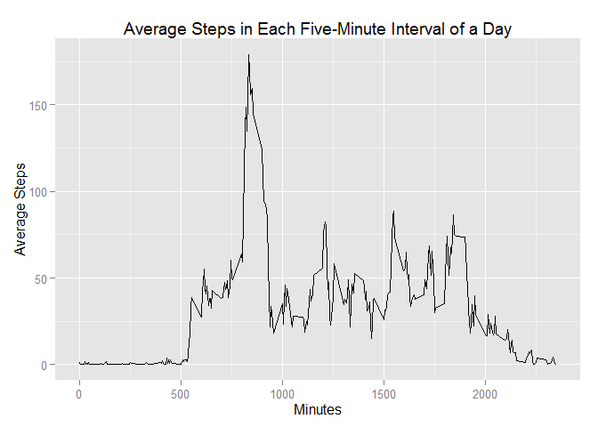

# Reproducible Research: Peer Assessment 1
### Lucas McLaughlin


## Loading and preprocessing the data

```r
library(ggplot2)
library(plyr)
unzip("activity.zip")
activity <- read.csv("activity.csv")
```
The data is preprocessed slightly by adding a new column containing the date
in POSIXct format, rather than as a factor.

```r
activity$date.POS <- as.POSIXct(activity$date, format = "%Y-%m-%d")
```

## What is mean total number of steps taken per day?

```r
total.steps <- tapply(activity$steps, activity$date, sum)
total.steps <- as.data.frame(total.steps)
total.steps$date <- as.POSIXct(rownames(total.steps), format = "%Y-%m-%d")
g <- ggplot(total.steps, aes(x = total.steps))
g + geom_histogram(binwidth = 2500) +
  xlab("Total Steps Per Day") +
  ylab("Frequency") + 
  xlim(0, round_any(max(total.steps$total.steps, na.rm = TRUE), 2500, ceiling)) +
  ggtitle("Histogram of Total Steps Per Day")
```

 

```r
mean.steps <- mean(total.steps$total.steps, na.rm = TRUE)
median.steps <- median(total.steps$total.steps, na.rm = TRUE)
```
The mean number of steps taken per day is approximately 10766.  
The median number of steps taken per day is 10765.

## What is the average daily activity pattern?

```r
activity$interval.cat <- as.factor(activity$interval)
interval.totals <- tapply(activity$steps, activity$interval.cat, sum, na.rm = TRUE)
interval.avg <- data.frame(interval = as.numeric(names(interval.totals)),
                           avg.steps = as.numeric(interval.totals)/length(unique(activity$date)))
g <- ggplot(interval.avg, aes(interval, avg.steps))
g + geom_line() + xlab("Minutes") + ylab("Average Steps") +
  ggtitle("Average Steps in Each Five-Minute Interval of a Day")
```

 

```r
max.index <- which.max(interval.avg$avg.steps)
```
The interval with the maximum average steps is 835.  
The number of steps in that interval is approximately 179.

## Imputing missing values

```r
na.total <- sum(is.na(activity$steps))
```
The total number of missing values is 2304.  
NAs are replaced with average values for each 5 minute interval.

```r
activity <- join(activity, interval.avg, by = "interval")
activity.adj <- activity
for (i in 1:nrow(activity.adj)){
  if(is.na(activity.adj$steps[i]) == TRUE){
    activity.adj$steps[i] <- activity.adj$avg.steps[i]
  }
}
activity.adj <- activity.adj[, 1:5]
```
Below is a histogram of the NA-adjusted data.

```r
total.steps <- tapply(activity.adj$steps, activity.adj$date, sum)
total.steps <- as.data.frame(total.steps)
total.steps$date <- as.POSIXct(rownames(total.steps), format = "%Y-%m-%d")
g <- ggplot(total.steps, aes(x = total.steps))
g + geom_histogram(binwidth = 2500) +
  xlab("Total Steps Per Day") +
  ylab("Frequency") + 
  xlim(0, round_any(max(total.steps$total.steps, na.rm = TRUE), 2500, ceiling)) +
  ggtitle("Histogram of Total Steps Per Day (Adjusted)")
```

 

```r
mean.steps <- mean(total.steps$total.steps, na.rm = TRUE)
median.steps <- median(total.steps$total.steps, na.rm = TRUE)
```
The mean number of steps per day, once adjusted for NAs, is approximately 10581.  
The median number of steps per day, once adjusted for NAs, is 10395.

## Are there differences in activity patterns between weekdays and weekends?
To compare weekday and weekend patterns, a factor variable "weekday" was created
which identifies a given date as weekday or weekend.  The data frame is then
split into two data frames for analysis.

```r
activity.adj$day.of.week <- weekdays(activity.adj$date.POS)
activity.adj$weekday <- rep("Weekday", times = nrow(activity.adj))
for (i in 1:nrow(activity.adj)){
  if(activity.adj$day.of.week[i] == "Saturday" | activity.adj$day.of.week[i] == "Sunday"){
    activity.adj$weekday[i] <- "Weekend"
  }
}
activity.adj$weekday <- as.factor(activity.adj$weekday)
weekday <- activity.adj[activity.adj$weekday == "Weekday", ]
weekend <- activity.adj[activity.adj$weekday == "Weekend", ]
weekday.interval.avg <- tapply(weekday$steps, weekday$interval.cat, sum)/
  length(unique(activity.adj$date))
weekend.interval.avg <- tapply(weekend$steps, weekend$interval.cat, sum)/
  length(unique(activity.adj$date))
```
The calculated totals are put into a temprorary data frame to be plotted.

```r
df <- data.frame(avg.steps = c(unname(weekday.interval.avg), unname(weekend.interval.avg)),
                 interval = as.numeric(rep(names(weekday.interval.avg), times = 2)),
                 weekday = factor(rep(c("Weekday", "Weekend"), each = length(weekday.interval.avg))))

g <- ggplot(df, aes(interval, avg.steps))
g + geom_line() + facet_grid(weekday ~ .) + xlab("Minutes") + ylab("Average Steps") +
  ggtitle("Average Steps in Each Five-Minute Interval of a Day (Adjusted)")
```

 

There does seem to be a noticeable difference in the step patterns on weekdays and weekends.  Overall, more steps are taken during the week.

